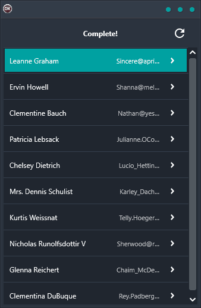

Looking for a reliable and easy-to-use cross-platform solution? Look no further than the Pull To Refresh Demo! This great application allows you to swipe down from the top and execute an event like refreshing data, making it perfect for anyone who needs a quick and easy solution. Plus, with support for Android, iOS, macOS, Windows, and Linux, it is the ideal choice for those who need a reliable and easy-to-use solution that works on any platform. And with its clean and simple interface, it is easy to use and provides the perfect solution for anyone looking for a cross-platform application. So why wait? Give the Pull To Refresh Demo a try today!

