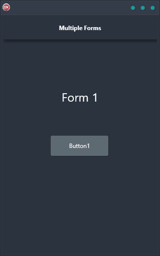

The Multiple Forms Demo is the perfect solution for those who need a reliable and easy-to-use solution that works on any platform. With support for Android, iOS, macOS, Windows, and Linux, it is the perfect choice for those who need a reliable and easy-to-use solution. The Multiple Forms Demo allows you to have visual controls and components on multiple forms that can be shown and hidden at runtime. The application is a cross-platform solution that is built using a single code base and single UI.

