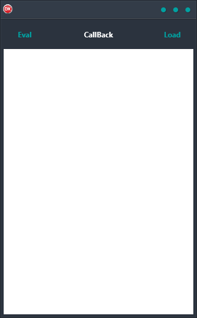

If you're looking for a reliable and easy-to-use solution for displaying web pages within your application, then the WebView Demo is exactly what you need. This cross-platform solution is built using a single code base and UI, and supports Android, iOS, macOS, Windows, and Linux. Plus, it's fully compatible with all major web browsers. WebView Demo is the perfect solution for anyone who needs a flexible and powerful way to display web content in their applications.

