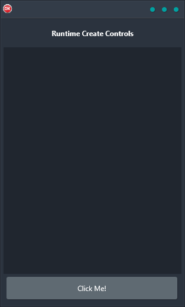

Are you looking for a cross-platform solution that is built using a single code base and single UI? Look no further than the Runtime Create Controls Demo! This demo shows how to create the interface of the application entirely at runtime via code, making it easy and reliable to use on any platform.

Android, iOS, macOS, Windows, and Linux are all supported with this easy-to-use solution. So whether you're developing for a mobile device or a desktop computer, the Runtime Create Controls Demo has you covered. Plus, its straightforward design makes it a breeze to get up and running quickly.

So don't wait any longer, check out the Runtime Create Controls Demo today and see how easy it is to create amazing interfaces for your next project!

