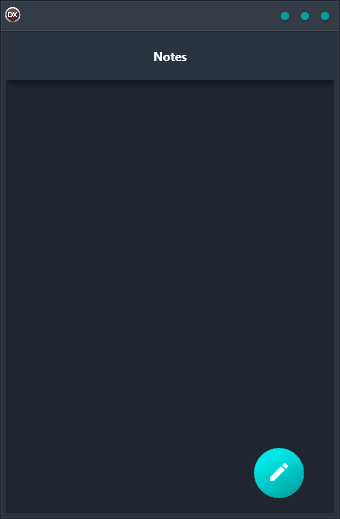

If you're looking for a simple and reliable solution for taking notes on any platform, the Notes App Demo is exactly what you need. This cross-platform app is built using a single code base and UI, so it supports Android, iOS, macOS, Windows, and Linux. Whether you're at home or on the go, you can easily take notes and stay organized with this handy app.

