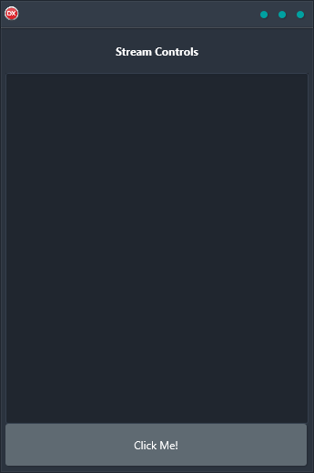

The Stream Controls demo is the perfect solution for saving interface elements out as text at runtime. It is a cross-platform solution that is built using a single code base and single UI. It supports Android, iOS, macOS, Windows, and Linux with a reliable and easy-to-use solution that works on any platform.

