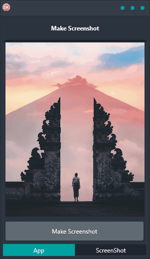

Creating high-quality screenshots of your application can be difficult and time-consuming. Make Screenshot is the perfect solution for taking screenshots of your app with ease. With a simple and easy-to-use interface, it only takes a few clicks to create beautiful and professional-looking screenshots. Whether you need to take a screenshot of the entire app or just specific interface components, Make Screenshot makes it easy. Plus, it's a cross-platform solution that works on any platform, whether it's Android, iOS, macOS, Windows, or Linux. So no matter what your environment is, you can always take screenshots easily with Make Screenshot.

