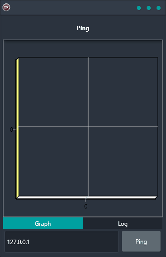

Are you looking for a reliable and easy-to-use cross-platform solution for sending pings? Look no further than the Ping Demo! This top-rated application is a breeze to use, and it works on any platform, including Android, iOS, macOS, Windows, and Linux. With Ping Demo, you'll be able to quickly and easily send pings and display them in a chart. Don't miss out on this must-have solution for anyone who needs to use a TCP/IP library.

