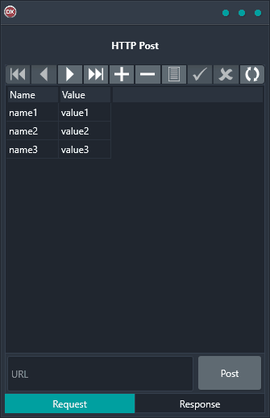

The HTTP Post demo is the perfect solution for adding a payload to an HTTP POST request and sending it. This cross-platform application is built using a single code base and single UI, making it extremely reliable and easy-to-use. It supports Android, iOS, macOS, Windows, and Linux, giving you the flexibility to work on any platform.

