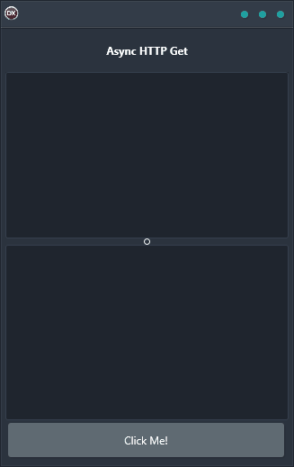

Making HTTP requests is a necessary part of many applications, but it can be a blocking operation. This can lead to poor performance and a bad user experience. The Async HTTP Get demo shows how to make an asynchronous HTTP request so that your application can continue to run while the request is being processed. This can lead to a much better user experience as well as better performance. The Async HTTP Get demo is a cross-platform solution that is built using a single code base and single UI. It supports Android, iOS, macOS, Windows, and Linux with a reliable and easy-to-use solution that works on any platform.

