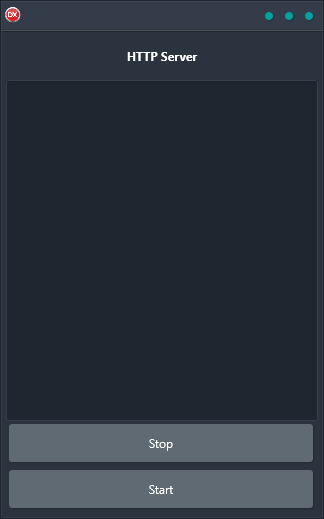

The HTTP Server demo is the perfect solution for those who need to quickly and easily create a cross-platform HTTP server. The demo shows how to do this with just a few lines of code, making it the perfect solution for developers of all levels of experience. The application is built using a single code base and single UI, making it extremely reliable and easy to use. It supports Android, iOS, macOS, Windows, and Linux, making it the perfect solution for those who need a reliable HTTP server that works on any platform.

