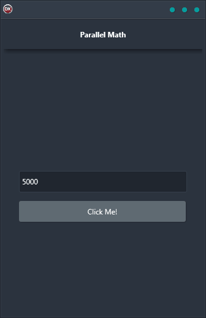

Welcome to our Parallel Math Demo! This demo shows how to use the parallel programming library to do math. The application is a cross-platform solution that is built using a single code base and single UI. It supports Android, iOS, macOS, Windows, and Linux with a reliable and easy-to-use solution that works on any platform. With this demo, you will see how easy it is to use our library to do complex mathematical operations in parallel. You will also learn about the benefits of using parallel computing to speed up your calculations. So, let's get started!

