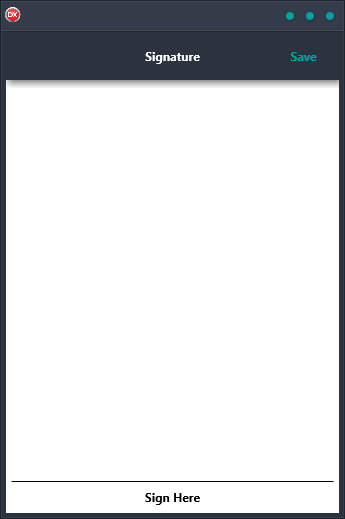

The Signature Demo is the perfect way to get a hand drawn signature from a user, no matter what platform they're on. With this easy-to-use cross-platform solution, you can support Android, iOS, macOS, Windows, and Linux with a single code base and UI. This reliable application makes it easy to work on any platform, making it the perfect solution for anyone who needs to get a signature from a user.

