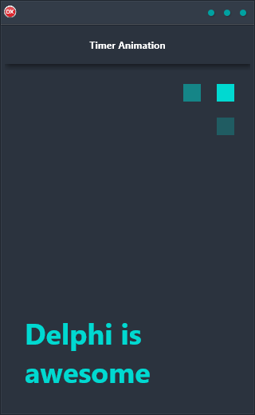

The Timer Animation demo is the perfect solution for creating a blinking cursor animation at runtime. With support for Android, iOS, macOS, Windows, and Linux, it is a reliable and easy-to-use solution that works on any platform. The application is built using a single code base and single UI, making it a cross-platform solution that is both reliable and easy to use.

