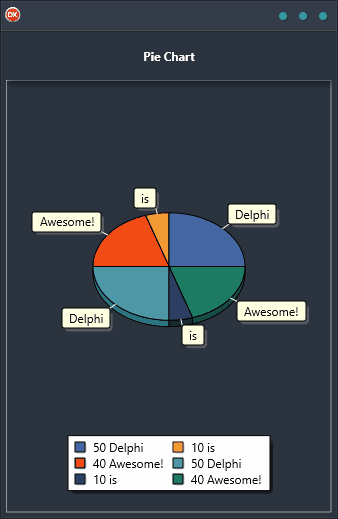

Looking for an easy way to create pie charts? Look no further than the Pie Chart Demo! This cross-platform solution is built using a single code base and single UI, making it simple and straightforward to use. Plus, it supports Android, iOS, macOS, Windows, and Linux. So regardless of your platform, the Pie Chart Demo has you covered. Best of all, it's a reliable and easy-to-use solution that gets the job done right. So why wait? Give the Pie Chart Demo a try today!

