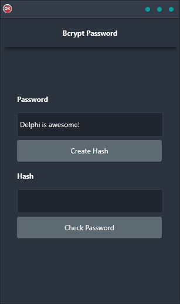

If you've been looking for a powerful and cross-platform password hashing solution, look no further than Bcrypt Password Demo. It's easy to use, works on any platform, and is built using a single codebase and UI. Whether you're running Android, iOS, macOS, Windows, or Linux, Bcrypt Password Demo will get the job done. Plus, it's reliable and totally free to use. So what are you waiting for? Try out Bcrypt Password Demo today!

