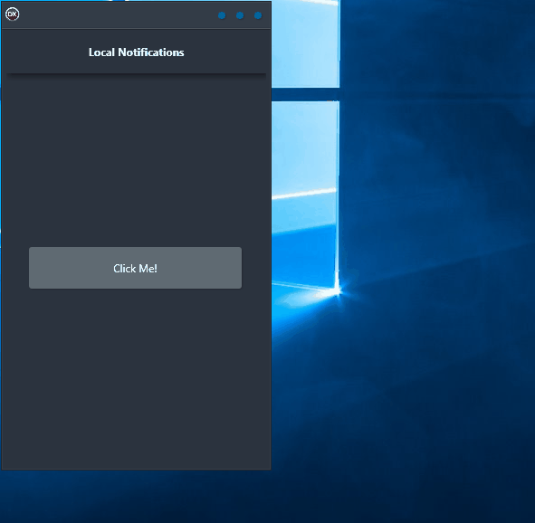

If you're looking for an easy way to display notifications from your application, then the Local Notifications demo is just what you need. This cross-platform solution is built using a single code base and single UI, so it's extremely reliable and easy to use. Plus, it supports all major platforms including Android, iOS, macOS, Windows, and Linux. No matter what platform your users are on, they'll be able to see your notifications without any hassle. So why wait? Try out the Local Notifications demo today and see how simple and effective it can be.

