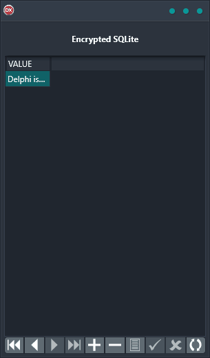

The Encrypted SQLite Demo is the perfect solution for encrypting your SQLite database. This cross-platform application is built using a single code base and single UI, making it extremely reliable and easy to use. It supports Android, iOS, macOS, Windows, and Linux, ensuring that you can encrypt your database on any platform. With this demo, you'll be able to quickly and easily encrypt your SQLite database, keeping your data safe and secure.

