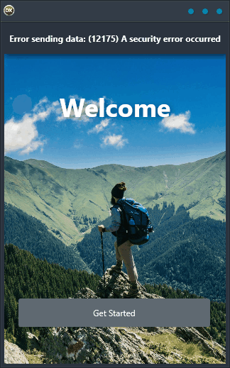

Are you looking for a reliable, easy-to-use solution that works on any platform? Look no further than the REST to SQLite demo. This cross-platform solution is built using a single code base and single UI. It supports Android, iOS, macOS, Windows, and Linux. With this demo, you can make a REST request to a server and then save the results into SQLite. This is a great solution for anyone who needs to store data on a server and then access it offline.

