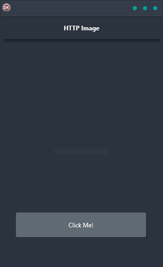

The HTTP Image Demo shows you how to download an image via HTTP and display it on any platform. This easy-to-use application is perfect for Android, iOS, macOS, Windows, and Linux users who want a reliable solution for displaying images. With a single code base and UI, the HTTP Image Demo is a cross-platform solution that is both reliable and easy-to-use.

