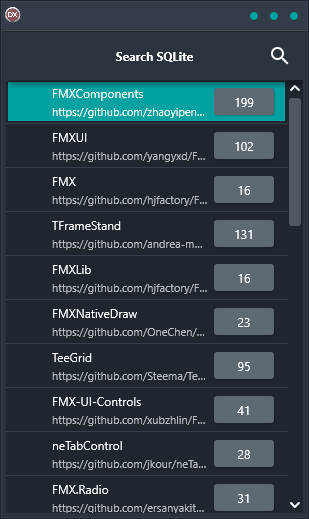

If you're looking for a powerful, yet easy-to-use solution for searching SQLite databases, the Search SQLite Demo is the perfect solution. It offers cross-platform support for Android, iOS, macOS, Windows, and Linux, so you can use it regardless of what platform you're working on. And because it's built using a single code base and has a single UI, it's extremely reliable and easy to use. Plus, it comes with full source code so you can customize it to meet your specific needs.

