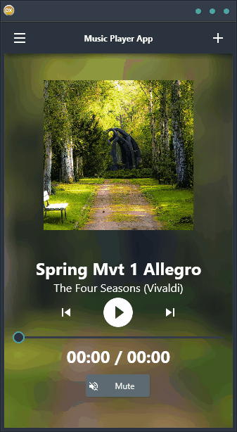

Looking for a reliable and easy-to-use music player app that works on any platform? Look no further than the Music Player App demo! This app is a cross-platform solution that is built using a single code base and single UI. It supports Android, iOS, macOS, Windows, and Linux with a user-friendly interface that anyone can use. Plus, the built-in media player component makes it easy to play music on the go. No matter what device you're using, the Music Player App demo is sure to give you the ultimate listening experience.

