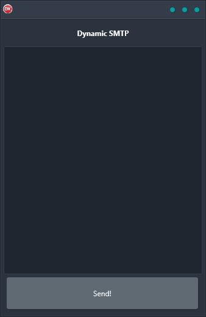

If you're looking for a reliable, cross-platform solution for sending messages via SMTP, look no further than Dynamic SMTP Demo. This easy-to-use application is built using a single code base and supports Android, iOS, macOS, Windows, and Linux. With its user-friendly interface, Dynamic SMTP Demo is the perfect solution for anyone who needs to send messages at runtime.

