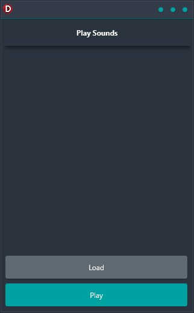

Looking for a reliable, easy-to-use cross-platform solution for playing short sound effects? Look no further than the Play Sounds demo! This demo shows how to use the AudioManager library to play sounds on any platform, from Android to iOS to Windows and more. AudioManager is a powerful and versatile tool that makes it easy to add sound effects to your applications. With support for all major platforms, it's the perfect solution for games or other applications that need sound effects. So check out the Play Sounds demo today and see how easy it is to add great sound effects to your next project!

