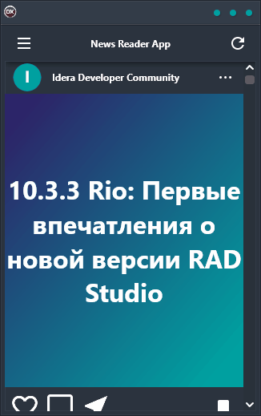

The News Reader App demo is the perfect solution for anyone who wants to stay up-to-date on the latest news. With this cross-platform app, you can easily view RSS feeds from any number of sources all in one place. The clean and easy-to-use interface makes it a snap to find and read articles from your favorite sites. Plus, the app supports Android, iOS, macOS, Windows, and Linux so you can use it no matter what platform you're on. Whether you're at home or on the go, the News Reader App demo is the perfect way to stay informed.

