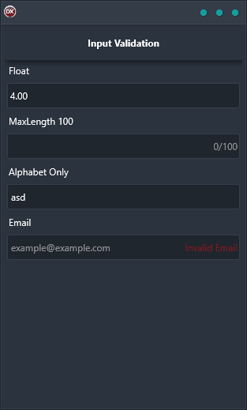

If you're looking for an easy and reliable way to validate text fields for data entry, then Input Validation is the solution for you. It's cross-platform and works on any platform, so whether you're using Android, iOS, macOS, Windows, or Linux, it will just work. The best part is that it requires no extra setup or configuration - just install and start using it.

