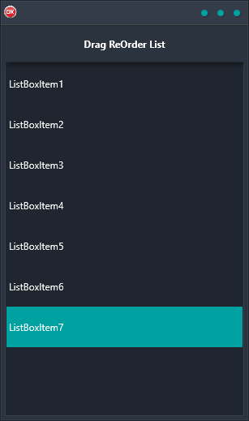

If you need a reliable and easy-to-use solution for allowing items in a TListBox to be re-ordered by drag and drop, then the Drag Re-Order List Demo is the perfect solution for you. This cross-platform application is built using a single code base and single UI, so it is extremely easy to use regardless of which platform you are working on. Additionally, it supports Android, iOS, macOS, Windows, and Linux – so you can be sure that it will work on any platform you need it to.

