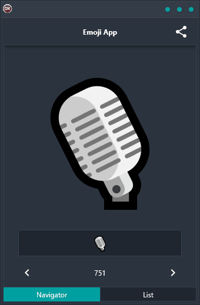

Looking for an easy and reliable way to add emojis to your app? Look no further than the Emoji App demo! This cross-platform solution is built using a single code base and single UI, making it super easy to use on any platform. Plus, it supports Android, iOS, macOS, Windows, and Linux. So no matter what device your users are on, they'll be able to see your amazing emojis!

